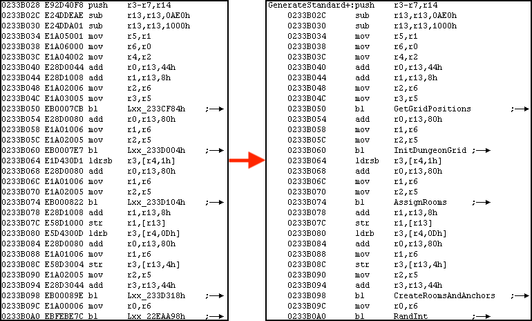
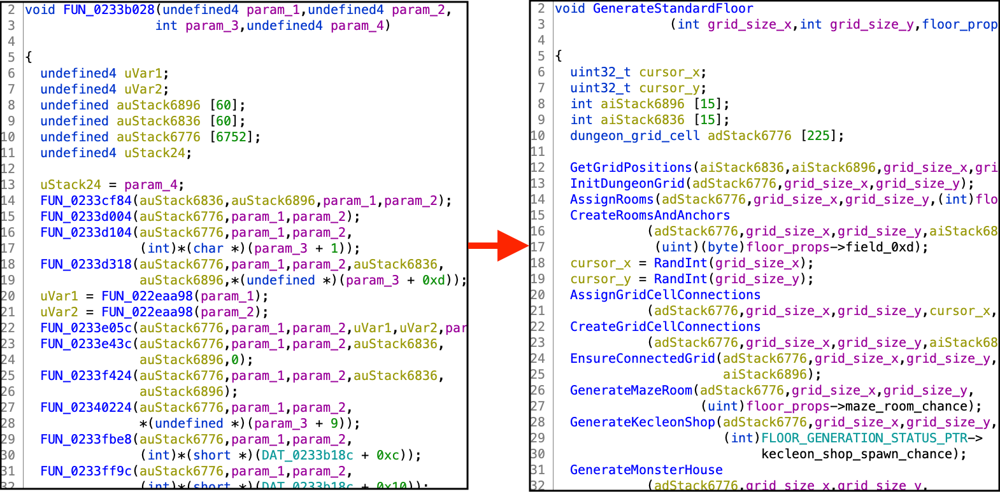

# Chapter 1: Reverse Engineering numbers

There are three key principles that together can explain how computers nowadays are capable of so many tasks:

- All data is numerical: some data is inherently so, and other forms of data can be transformed into numbers. (The rules used to transform some form of data into a number are called a 'format' or an 'encoding', and they are often more or less arbitrary and vary from one data type to the next. For instance, an image may be stored using the PNG or JPEG formats, and this text can be stored using the UTF-8 encoding.)

- CPUs handle data in the form of numbers: they take instructions (the commands that they will execute) encoded as numbers, operate on data encoded as numbers, and produce results encoded as numbers. They also interact with the outside world by sending and receiving numbers.

- Other hardware is designed to process these numbers, generate them from external inputs or transform them into outputs: for example, keyboards turn keypresses into numbers, and screens turn numbers into visible light (which renders images, text, etc.). 

Nowadays most computers are designed to work with binary numbers (0s and 1s) because they're the easiest to detect inside CPUs and other hardware. 0 = no electric signal, 1 = electric signal. (While we could make computers that work with decimal numbers[1], due to electrical engineering reasons making them work with 0s and 1s is easier). These binary numbers are called Machine Code.

Modern computers work with multiple units of information: a Bit (single binary digit), a Byte (8 binary digits or 2 hex digits), or a Word (a multiple of Bytes, varies from CPU arch to arch).

When dealing with Machine Code hex bytes are the most common representation used because 2 hexadecimal digits can fit exactly as many values as 8 binary digits. 

The Machine code underneath beneath every piece of data or instruction can be viewed by pretty much anyone using special editors called "Hex Editors", You might already be familiar with those apps and the hex views like this if you've ever done hex-edit based hacks/cheats.

The fact that these hex bytes are available to everyone means that we can reverse engineer the inner workings of every program with enough time and effort. 

Through a process called Disassembly we can turn these hex bytes back to more readable but still compact form called Assembly, a series of CPU instructions alongside the data given to the CPU as arguments. The assembly becomes more readable as we feed it info we already know.

Then through another process called Decompilation, we can make an educated guess about what the original C/C++ code could have looked like before turning into CPU instructions. Which enables us to understand the program better and even modify it if we need to.

The two above images are from PMD-SkyDebug, a similar project where Reverse Engineers documented Pokemon Mystery Dungeon: Explorers of Sky's code by disassembling, decompiling, and documenting the game's code.

The same process can be applied to almost any other program, and here at Shutan our goal is to use the same process on Pokemon XY, making a framework where everyone can reverse engineer the parts of the code they're interested in. Which in turn makes it possible to modify or extend that part of the game!

The following chapterss will dive into how Assembly works, how we get to hex bytes from pure C/C++ code, the tools we can use to Reverse Engineer the game, and some of the most common ways C/C++ code turns into Assembly.
